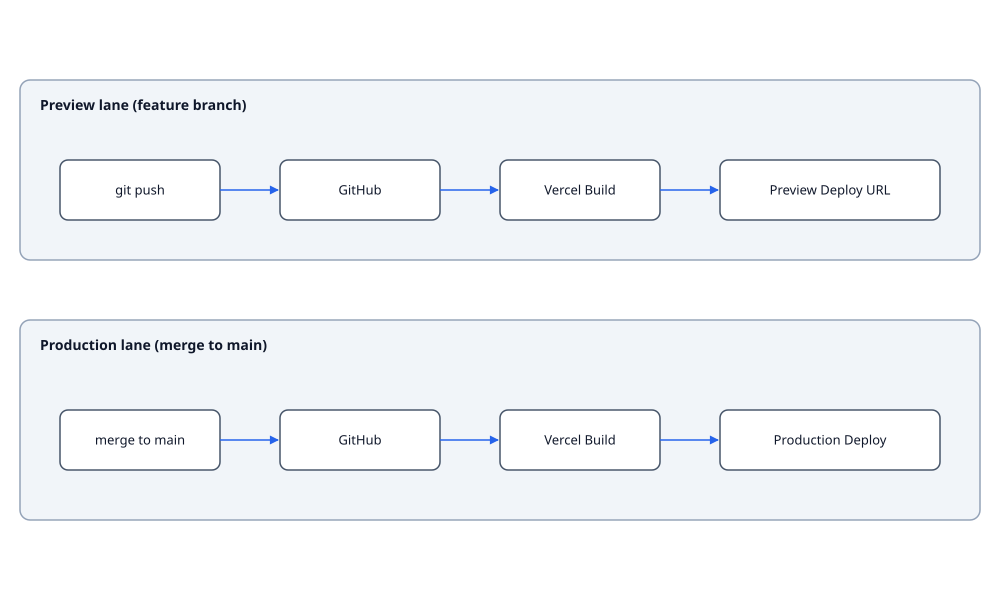

# Deployment

Mini Marty is a static + middleware Next.js app deployed to Vercel.

## Pipeline

1. Push to a branch -> Vercel preview deploy.
2. Merge to `main` -> production deploy.
3. GitHub Actions (`.github/workflows/ci.yml`) runs lint, typecheck, unit tests with coverage gate, build, Playwright, and a non-blocking Lighthouse audit on every PR.

## Vercel config

`vercel.json` sets the framework, build command, and install command. CSP and other security headers are emitted by `proxy.ts` at request time; Vercel's edge does not need to know.

### Why `--legacy-peer-deps`

`installCommand` is `npm ci --legacy-peer-deps`. The app uses React 19, which is ahead of the peer range some transitive packages (notably `@vercel/analytics`) declare. `--legacy-peer-deps` keeps `npm ci` from failing on a peer-range mismatch we know is safe; remove the flag once the upstream peer ranges catch up.

## Feature flags

`src/lib/flags.ts` reads from `process.env` at module evaluation. Public flags:

| Flag | Purpose |
|---|---|
| `NEXT_PUBLIC_SENTRY_DSN` | Sentry DSN — when set, `SentryErrorReporter` replaces `MemoryErrorReporter` |
| `NEXT_PUBLIC_ANALYTICS` | Set to `vercel` to enable `VercelAnalytics`; any other value (including unset) leaves `NoopAnalytics` in place |

Off by default, opt-in via Vercel env UI. No flag toggles destructive behaviour.

## Rollback

Vercel's UI exposes one-click rollback to any prior production deploy. There is no database, so rollback is safe.

## Smoke check post-deploy

- Home page renders, 3D scene visible
- `/python-editor` loads Pyodide and prints `hello from marty`
- `/block-editor` shows toolbox and workspace
- DevTools console shows no CSP violations
