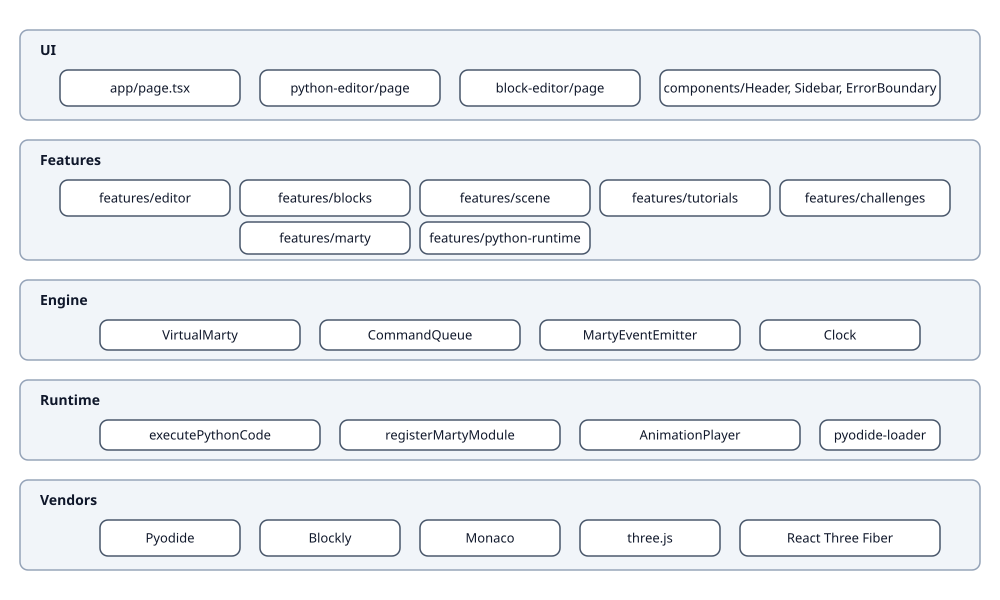
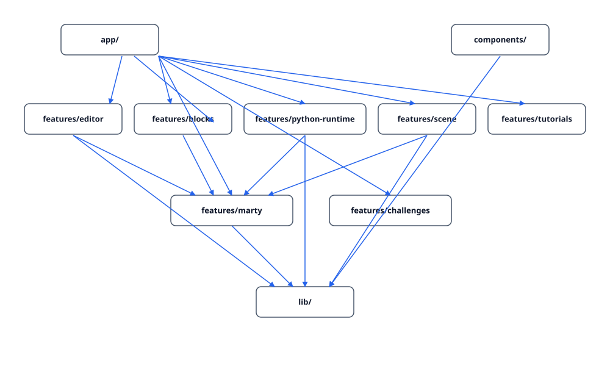

# Architecture overview

Mini Marty is a layered Next.js app. Each layer depends only on those below it.

## Layers

| Layer | Responsibility | Key symbols |
|---|---|---|
| App | Routing, page composition | `app/page.tsx`, `app/python-editor/page.tsx`, `app/block-editor/page.tsx` |
| UI | Reusable React components | `components/Header`, `components/Sidebar`, `components/system/ErrorBoundary` |
| Features | Domain logic and screens | `features/marty`, `features/python-runtime`, `features/scene`, `features/blocks`, `features/editor`, `features/tutorials`, `features/challenges` |
| Engine | Robot abstraction + queue | `VirtualMarty`, `CommandQueue`, `MartyEventEmitter` |
| Runtime | Python execution | `executePythonCode`, `registerMartyModule`, `pyodide-loader` |
| Vendors | Third-party libs | Pyodide, Blockly, Monaco, three.js, R3F |

## Cross-cutting

- Observability: `ObservabilityProvider` injects `Logger` + `ErrorReporter`
- Analytics: `AnalyticsProvider` injects an `Analytics` port; `VercelAnalytics` or `NoopAnalytics`
- Theming: `ThemeProvider` toggles Tailwind dark class
- Security: `proxy.ts` sets a static CSP plus companion hardening headers

## Module dependency graph

