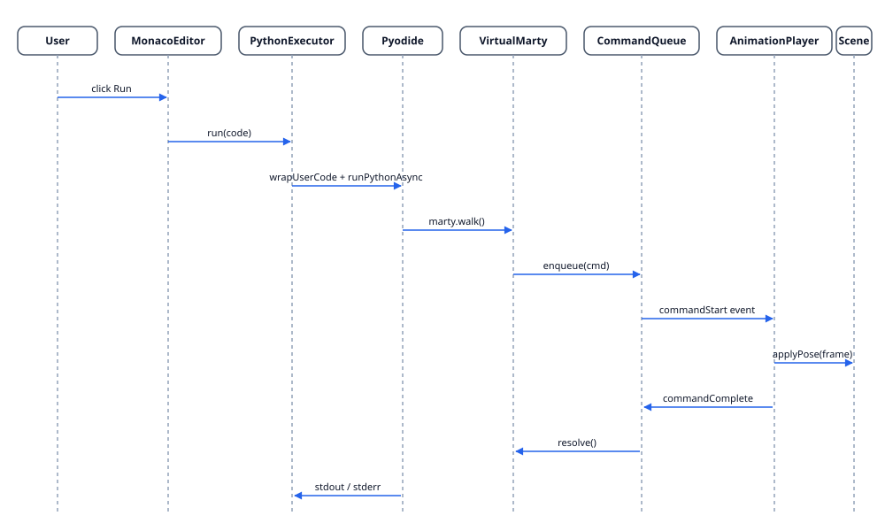

# Python runtime

Python runs in the browser via [Pyodide](https://pyodide.org). The runtime layer hides Pyodide behind a small surface so the rest of the app can speak Python without touching WebAssembly.

## Pipeline

1. `usePyodide` loads the Pyodide runtime once per session through `pyodide-loader`. A `pyodide-registry` singleton prevents duplicate loads when React Strict Mode double-mounts.
2. `registerMartyModule` injects a `martypy`-shaped Python module backed by a JS bridge to `VirtualMarty`.
3. `executePythonCode` wraps the user's code with `wrapUserCode` (adds an async entrypoint) and runs it; stdout, stderr, and errors are streamed via `ExecutorCallbacks`.
4. Each `marty.<action>()` call enqueues a command on the `CommandQueue`.

## Error formatting

`formatPythonError` trims tracebacks down to the user's frame so a 13-year-old sees one useful line, not the wrapper machinery.

## Files

- `features/python-runtime/pyodide-loader.ts` — CDN load + version pin
- `features/python-runtime/pyodide-registry.ts` — singleton across React lifecycles
- `features/python-runtime/martypy-module.ts` — `MARTYPY_MODULE_CODE`, `createMartyBridge`
- `features/python-runtime/python-executor.ts` — `executePythonCode`, `wrapUserCode`, `formatPythonError`
- `features/python-runtime/hooks/usePyodide.ts` — React lifecycle
- `features/python-runtime/hooks/usePythonExecution.ts` — run/stop/console state
