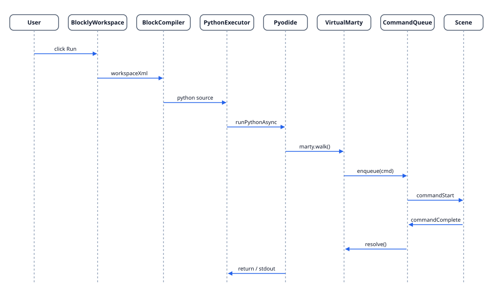

# Scene

The 3D view is React Three Fiber. The robot model is procedural (no GLTF); joints are direct Three.js groups updated each frame.

## Sequence from blocks

## Animation pipeline

`AnimationPlayer` consumes `AnimationSequence` definitions (`WALK_SEQUENCE`, `DANCE_SEQUENCE`, etc.), interpolates keyframes via `lerpJoints`, `lerpEyes`, `lerpPose`, and writes the resulting `MartyPose` into the model handle each frame. `useMartyAnimation` is the React adapter that subscribes to `MartyEventEmitter` and drives the player.

## Pose model

`MartyPose` is a flat record of joint angles, eye position, and lift. `MartyModelHandle.applyPose` writes to refs; no React re-render per frame.

## Performance

The scene pauses on `document.hidden` and respects `prefers-reduced-motion`. The canvas itself loads via `next/dynamic` with `ssr: false`.

## Files

- `features/scene/components/MartyScene.tsx` — top-level R3F canvas
- `features/scene/components/AnimatedMarty.tsx` — model + animation wiring
- `features/scene/components/MartyModel.tsx` — procedural geometry
- `features/scene/animation/player.ts` — `AnimationPlayer`
- `features/scene/animation/definitions.ts` — keyframe sequences
- `features/scene/animation/useMartyAnimation.ts` — React hook
