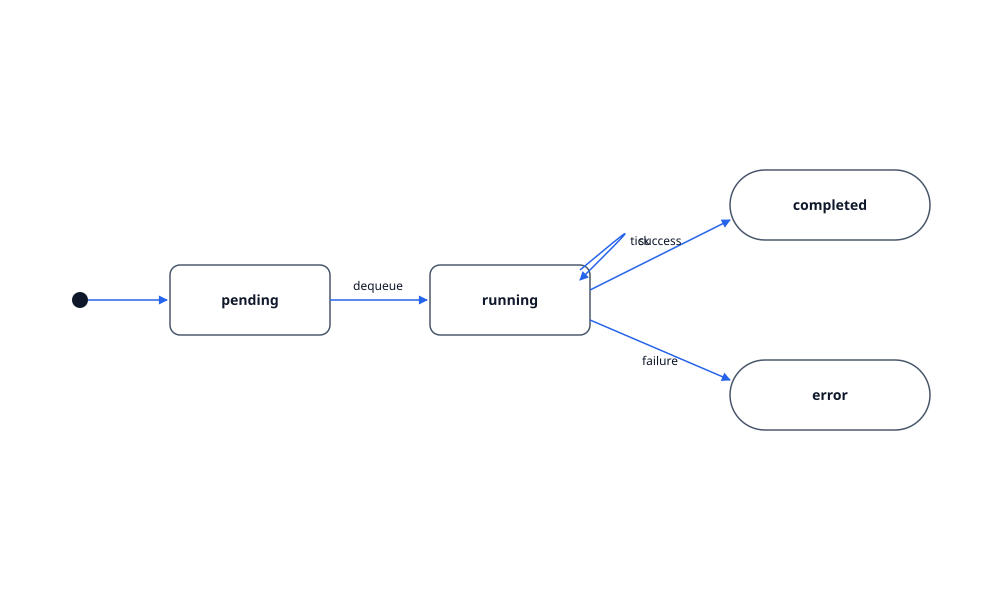

# Virtual Marty

`VirtualMarty` is the in-browser robot model. It mirrors the public API of `martypy` (the real Marty robot's Python SDK), exposing high-level actions like `walk`, `dance`, `kick`, `eyes`, and `arms`.

## Command lifecycle

Each action enqueues a `MartyCommand` into a `CommandQueue`. The queue resolves commands one at a time via the injected `Clock`, emitting events through `MartyEventEmitter`. Consumers (the animation player, the console) subscribe via `onCommandStart` and `onCommandComplete`.

States: `pending` -> `running` -> `completed` or `error`.

## Clock injection

`CommandQueue` accepts a `Clock`. `RealClock` uses `setTimeout`; `FakeClock` advances synthetically in tests. This keeps timing logic deterministic under Vitest.

## Execution modes

`ExecutionMode` is either `blocking` (await each command) or `non-blocking` (fire-and-forget). The Python wrapper uses blocking mode so `await marty.walk()` reads naturally.

## Files

- `features/marty/virtual-marty.ts` — the public surface
- `features/marty/command-queue.ts` — FIFO queue + clock
- `features/marty/clock.ts` — `Clock`, `RealClock`, `FakeClock`
- `features/marty/event-emitter.ts` — typed pub/sub
- `features/marty/types.ts` — `MartyCommand`, `MartyEvent`, joint types
